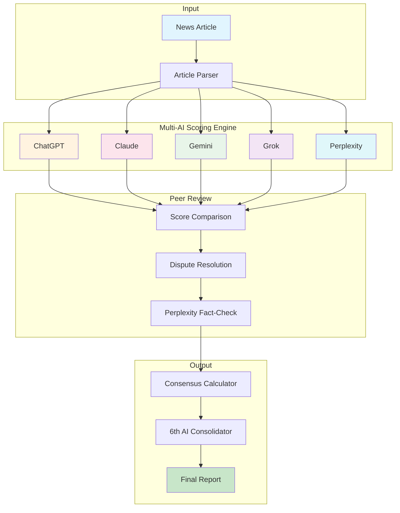

# News Intelligence System


[](https://codecov.io/gh/jjshay/news-intelligence)


**Score and analyze news articles using 5 different AI models - get the smartest insights from multiple perspectives.**

[](https://asciinema.org/a/PR2XX9dpIx4095He)

---

## What Does This Do?

This tool helps you evaluate news articles using multiple AI "judges":

1. **Fetches articles** from news APIs
2. **Sends to 5 AI models** (ChatGPT, Claude, Gemini, Grok, Perplexity)
3. **Each AI scores** the article's relevance/quality
4. **Compares opinions** through peer review
5. **Generates consensus** on what matters most

**Why?** Different AI models have different perspectives. By using multiple models, you get more balanced, reliable analysis than trusting any single AI.

---

## Quick Start

```bash
# Clone the repo
git clone https://github.com/jjshay/news-intelligence.git
cd news-intelligence

# Install dependencies
pip install -r requirements.txt

# Run the interactive demo (no API keys needed!)
python demo.py

# Or run the visual showcase
python showcase.py

# Try with sample data
python demo.py --input examples/sample_articles.json
```

### Sample Output
See `sample_output/analysis_report.json` for example results.

---

## Architecture



## How It Works

```
News Article
     │
     ▼
┌─────────────────────────────────────────────────────────────┐
│                    5 AI Evaluators                          │
├─────────┬─────────┬─────────┬─────────┬─────────────────────┤
│ ChatGPT │ Claude  │ Gemini  │  Grok   │    Perplexity       │
│  8/10   │  7/10   │  9/10   │  8/10   │  9/10 (Final Say)   │
└─────────┴─────────┴─────────┴─────────┴─────────────────────┘
     │
     ▼
┌─────────────────────────────────────────────────────────────┐
│  6th AI Consolidator                                        │
│  "Final score: 8.2/10                                       │
│   - Strong factual content (ChatGPT, Claude agree)          │
│   - Timely topic with high relevance (Gemini, Perplexity)   │
│   - Minor bias detected (Grok dissent)                      │
│   - Recommended for sharing"                                │
└─────────────────────────────────────────────────────────────┘
```

---

## The Scoring Process

### Step 1: Health Check
System verifies all AI APIs are working before proceeding.

### Step 2: Individual Scoring
Each AI evaluates the article on:
- Factual accuracy
- Source credibility
- Relevance to your interests
- Potential bias
- Writing quality

### Step 3: Peer Pairing
AIs are randomly paired to compare scores. Perplexity (with web access) always participates as a fact-checker.

### Step 4: Final Verdict
Perplexity has the "final say" on disputes, using its real-time web search to verify claims.

### Step 5: Consolidation
A 6th AI call summarizes all opinions into clear bullet points.

---

## AI Models Used

| Model | Provider | Strengths |
|-------|----------|-----------|
| ChatGPT | OpenAI | Strong reasoning, broad knowledge |
| Claude | Anthropic | Nuanced analysis, safety-focused |
| Gemini | Google | Multi-modal, up-to-date |
| Grok | xAI | Contrarian views, real-time info |
| Perplexity | Perplexity AI | Web search, fact verification |

---

## Real Usage Setup

### 1. Get API Keys

You'll need API keys from:
- [NewsAPI](https://newsapi.org) - News data
- [OpenAI](https://platform.openai.com) - ChatGPT
- [Anthropic](https://console.anthropic.com) - Claude
- [Google AI](https://makersuite.google.com) - Gemini
- [xAI](https://x.ai) - Grok
- [Perplexity](https://perplexity.ai) - Perplexity AI

### 2. Configure Environment

```bash
# Copy example file
cp .env.example .env

# Add your keys
nano .env
```

### 3. Run

```bash
python fetch_news.py
```

---

## Cost Breakdown

| Service | Approximate Cost |
|---------|------------------|
| NewsAPI | Free tier: 100 requests/day |
| ChatGPT (GPT-4) | ~$0.01-0.03 per article |
| Claude | ~$0.01-0.02 per article |
| Gemini | Free tier available |
| Grok | ~$0.01 per article |
| Perplexity | ~$0.01 per article |

**Total per article**: About $0.05-0.10

---

## Files

| File | Purpose |
|------|---------|
| `fetch_news.py` | Main scoring pipeline |
| `news_responder_gui.py` | GUI version with visual interface |
| `news_sheet_comment_responder.py` | Google Sheets integration |
| `process_news_in.py` | News processing utilities |
| `demo.py` | Demo without API keys |

---

## Output Example

```
ARTICLE: "AI Breakthrough in Medical Diagnosis"
Source: MIT Technology Review

INDIVIDUAL SCORES:
  ChatGPT:    8/10 - "Strong technical content, well-sourced"
  Claude:     7/10 - "Good but overstates near-term impact"
  Gemini:     9/10 - "Highly relevant, confirms with recent research"
  Grok:       8/10 - "Interesting but missing regulatory context"
  Perplexity: 9/10 - "Verified claims against 3 recent papers"

PEER REVIEWS:
  ChatGPT + Perplexity: Agreement (8.5 avg)
  Claude + Grok: Minor disagreement on timeline

FINAL CONSENSUS: 8.2/10

KEY INSIGHTS:
  - Factual claims verified by multiple sources
  - Technical accuracy high but accessibility could improve
  - Relevant to healthcare AI interests
  - Recommended for professional network share
```

---

## Features

- **Multi-Model Consensus**: Don't trust one AI - get 5 opinions
- **Fact Verification**: Perplexity cross-checks claims
- **Peer Review**: AIs compare and discuss scores
- **Google Sheets Integration**: Store results automatically
- **GUI Available**: Visual interface with progress tracking

---

## License

MIT - Use freely for your news analysis needs!
